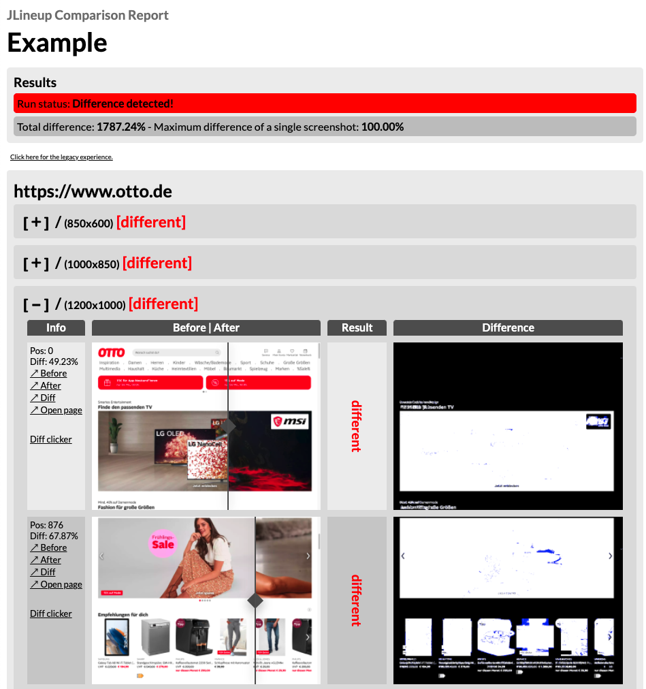

[](#)

## Status
[](https://github.com/otto-de/jlineup/actions?query=workflow%3ABuild)
[](https://search.maven.org/search?q=g:de.otto%20a:jlineup-cli%20v:RELEASE%20p:jar)
[](https://search.maven.org/search?q=g:de.otto%20a:jlineup-web%20v:RELEASE%20p:jar)
[](https://github.com/otto-de/jlineup/releases)


## News

**2023-08-16**: **JLineup 4.9.0**, which fixes latest Chromedriver issues, requires **Java 17** or later due to dependency updates that have this requirement.

**2023-03-09**: **Chrome 111** requires a new parameter to fix the connection with the current Selenium version built
into JLineup. This was added in [JLineup 4.8.3](https://github.com/otto-de/jlineup/releases/tag/v4.8.3). Background
information may be found in this [thread](https://groups.google.com/g/chromedriver-users/c/xL5-13_qGaA/m/oTA9W3cQAgAJ).

**2023-02-14**: **Chrome 110** replaced the "old" `--headless` parameter, that was used by JLineup. If you face problems with CHROME_HEADLESS runs,
please update to [JLineup 4.8.3](https://github.com/otto-de/jlineup/releases/tag/v4.8.3), which uses the new `--headless=new` parameter.
Chrome headless mode's device size specifications now include the Browser controls and the window frame, except you switch to mobile emulation.

## About

JLineup is a tool which is useful for automated visual regression tests of web pages, especially in continuous delivery pipelines.
It can be used as a simple command line tool or as a small web service which is controlled via REST API.

JLineup shoots and compares screenshots of a web page at two consecutive points in time.
It does a pixel by pixel comparison of both runs and generates a HTML and a JSON report.
Behind the scenes, it uses Selenium and a browser of choice (currently Chrome, Chromium and Firefox are supported).

JLineup has no other dependencies than web browser (Firefox or Chrome/Chromium) and a JVM.
*Experimental*: There's also a self-contained Linux AMD64 build of the CLI version that doesn't even require a JVM.

## Example

Let's take this little example [config](docs/CONFIGURATION.md) for a check of otto.de during a deployment:

```json
{
  "urls": {
    "https://www.otto.de": {
      "paths": [ 
	    "/"
      ],
      "devices" : [ {
        "width" : 850,
        "height" : 600,
        "pixel-ratio" : 1.0,
        "device-name" : "DESKTOP",
        "touch" : false
      }, {
        "width" : 1000,
        "height" : 850,
        "pixel-ratio" : 1.0,
        "device-name" : "DESKTOP",
        "touch" : false
      }, {
        "width" : 1200,
        "height" : 1000,
        "pixel-ratio" : 1.0,
        "device-name" : "DESKTOP",
        "touch" : false
      } ]
    }
  },
  "wait-after-page-load" : 0.5,
  "browser" : "chrome-headless"
}
```

JLineup runs before and after the deployment and generates a report like this:

[](https://otto-de.github.io/jlineup/docs/example-report/report.html)

There's also a JSON report, which is great if you want to check things by script:

[Example JLineup JSON Report](docs/example-report/report.json)

## Quick Howto

JLineup CLI comes as executable Java Archive. Java 17 or higher has to be available to run it.

Open a terminal and download it like this:

    wget https://repo1.maven.org/maven2/de/otto/jlineup-cli/4.9.2/jlineup-cli-4.9.2.jar -O jlineup.jar

Then type

    java -jar jlineup.jar --help

to see the command line help.

See the [CLI documentation](docs/CLI.md) for more details and a small tutorial.

## Integration example

This is an example, how JLineup can be helpful in your automated build and deploy pipeline.
Let's assume, this is part of a continuous integration pipeline:


## Browser Compatibility

JLineup 4.9.2 was tested successfully with

* Chrome 120.x
* Firefox 120.x
        
Chrome or Firefox have to be installed on the system if you want to use one of them.

## Documentation

[JLineup as CLI tool](docs/CLI.md)

[JLineup as web server](docs/WEB.md)

[JLineup Job Configuration](docs/CONFIGURATION.md)

## Third Party Libraries

JLineup uses some third party tools and libraries

##### Selenium

* [Selenium](http://www.seleniumhq.org/) is licensed under the [Apache 2.0 License](http://www.apache.org/licenses/LICENSE-2.0).

##### Webdrivermanager

* [Webdrivermanager](https://github.com/bonigarcia/webdrivermanager) is licensed under the [Apache 2.0 License](http://www.apache.org/licenses/LICENSE-2.0).

##### Jackson

* [Jackson](https://github.com/FasterXML/jackson) is licensed under the [Apache 2.0 License](http://www.apache.org/licenses/LICENSE-2.0).

##### Logback

* [Logback](http://logback.qos.ch/) is licensed under the [Eclipse Public License](http://www.eclipse.org/legal/epl-v10.html).
* The [SLF4J](http://www.slf4j.org) API is licensed under the [MIT License](http://www.slf4j.org/license.html).

##### Thymeleaf

* [Thymeleaf](http://www.thymeleaf.org/) is licensed under the [Apache 2.0 License](http://www.apache.org/licenses/LICENSE-2.0).

##### Edison Microservice

* [Edison Microservice](https://github.com/otto-de/edison-microservice) is licensed under the [Apache 2.0 License](http://www.apache.org/licenses/LICENSE-2.0).

##### Spring Boot

* [Spring Boot](http://spring.io/projects/spring-boot) is licensed under the [Apache 2.0 License](http://www.apache.org/licenses/LICENSE-2.0).

##### GraalVM Community Edition

* The binary cli version is built with [GraalVM Community Edition](https://github.com/oracle/graal/). GraalVM CE brings it's own [Product License](https://github.com/oracle/graal/blob/master/LICENSE).

##### Image Compare Viewer

* [Image Compare Viewer](https://github.com/kylewetton/image-compare-viewer) is licensed under the [MIT License](https://github.com/kylewetton/image-compare-viewer/blob/master/LICENSE).

##### Google Fonts

* [Google Fonts](https://developers.google.com/fonts/) are used in the HTML report. These are the [terms](https://developers.google.com/fonts/terms).

### Historic Facts

JLineup is a configuration compatible replacement
for Lineup, implemented in Java. The original
[Lineup](https://github.com/otto-de-legacy/lineup) was
a Ruby tool, but is not maintained any more.

Credit for original Lineup goes to [Finn Lorbeer](http://www.lor.beer/).


### Contact

If you have questions or proposals, please open an issue or write an email to marco DOT geweke AT otto.de

