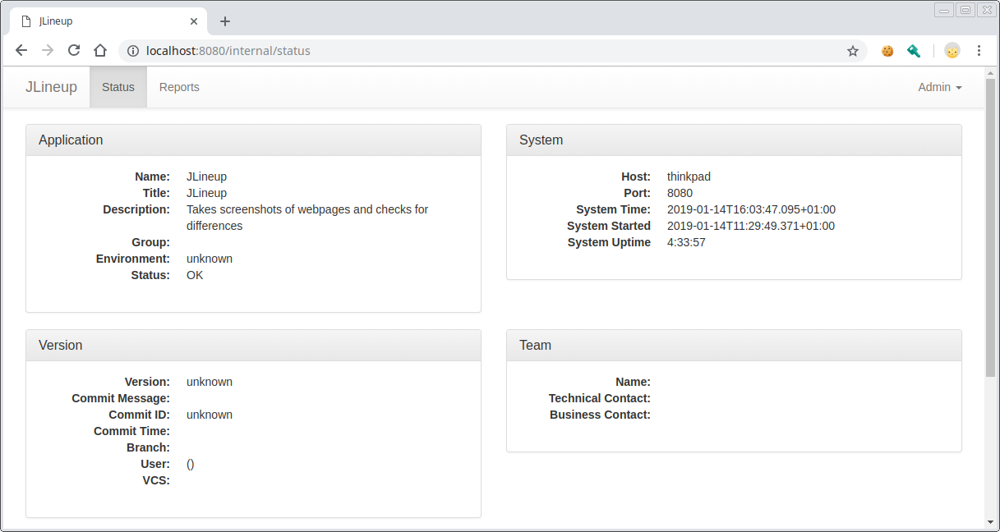
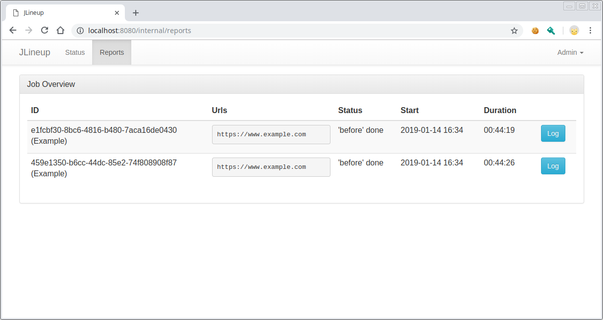
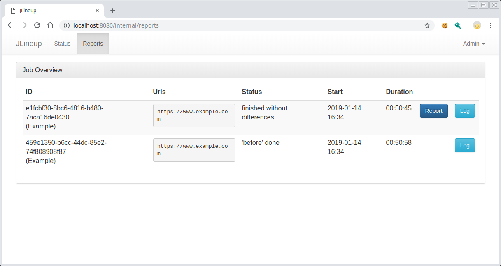
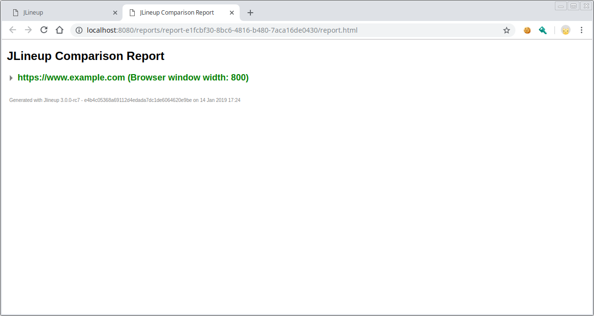
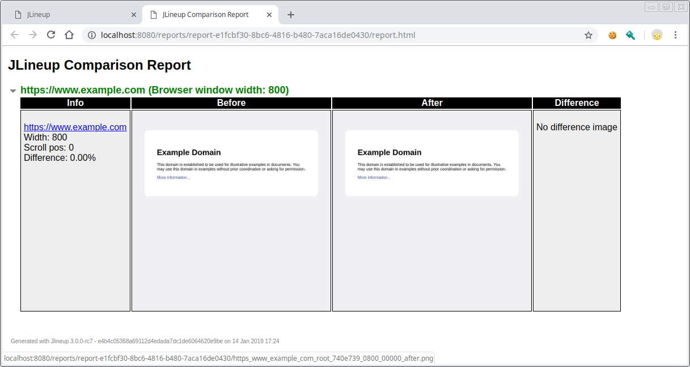

# Web server instructions

JLineup can be run as a small web service which offers a simple REST
interface to take JLineup jobs. JLineup WEB requires at least Java 17.

## Installation

You can simply download the web version by getting the jlineup-web.jar
from Maven Central in a terminal window:

`wget https://repo1.maven.org/maven2/de/otto/jlineup-web/4.9.0/jlineup-web-4.9.0.jar -O jlineup-web.jar`

Now you have a `jlineup-web.jar` in your current directory.

For best results, you need a "real" web browser installed on your system.
JLineup supports Google Chrome (Chromium also works) or Firefox at the
moment. As JLineup is written in Java, you need a Java Runtime
Environment in version 11 or higher. OpenJDK is fine.

If those prerequisites are fulfilled, you can start the JLineup server:

`java -jar jlineup-web.jar`

If you see an error similar to this:

```
 [main] ERROR o.a.catalina.core.StandardService - Failed to start connector [Connector[HTTP/1.1-8080]]
...
Caused by: java.net.BindException: Address already in use
```

something else is running on port 8080 on your machine. You could stop
the conflicting server or you could run JLineup on another port like this:

`java -Dserver.port=5000 -jar jlineup-web.jar`

Everything is up and running now for your first steps. The examples assume
that JLineup runs on port 8080. Change them if you run it on a different one.

Head to http://localhost:8080/internal/status with a browser to see
JLineup's status page. It should look similar to this:



## REST Interface

JLineup has a small set of methods, which live in one context:

### Context: `/runs`

* ***GET*** `/runs/{runId}`
    * Gets you the status of a given run
    * runId is a String. You create a *runId* through starting a 'before' step
    * Parameters: None
    * The content type is application/json

* ***POST*** `/runs`
    * Post your [JLineup config](CONFIGURATION.md) to this endpoint to start a 'before' run.
    * If your config is valid, JLineup sends an `202 Accepted` return code.
    * The created *runId* is returned in the location header.
    * The content type is application/json

* ***POST*** `/runs/{runId}`
    * Starts an 'after' run for the given *runId*.
    * The content type is application/json

*Hint*: You can always see a human readable representation of your jobs
on http://localhost:8080/internal/reports

### Example

Use a REST client of your choice ans post the example config to your server:

POST `http://localhost/runs/`

Body:

```
{
  "name": "Example",
  "urls": {
    "https://www.example.com" : {}
  },
  "browser": "chrome-headless"
}
```

Content-Type: application/json

You should get an 202 as answer. Then just post the same config again to
create a second run.

If you go to http://localhost:8080/internal/reports now, you should see
your two runs like this:



Both runs finished the 'before' step, like their status says.

Now start the 'after' run for one of them by taking the existing ID and
post to it:

POST `http://localhost/runs/PUT_THE_ID_HERE`.

The reports page should show that one of the runs went through the 'after'
step and a report was generated:



You can click on the *Report* button to see the report:



Click on the green url to open the details:




## Configuration

The JLineup web server uses Edison Microservice which is based on
Spring Boot. You can configure it by application.properties or yaml
like any Spring Boot application.

These are the internal defaults:

```yaml
jlineup:
  working-directory: /tmp/jlineup/
  screenshots-directory: report-{id}
  report-directory: report-{id}
  max-parallel-jobs: 1
  cleanupProfile: true

edison:
  application:
    title: JLineup
    description: Takes screenshots of webpages and checks for differences

spring:
  application:
    name: JLineup
    
```

You can save this file as application.yml and put it into the same directory
as jlineup-web.jar. After that, you can change it's contents to your needs.

Additional to the JLineup configuration properties below, you can use all
[Spring Boot Application Properties](https://docs.spring.io/spring-boot/docs/current/reference/html/common-application-properties.html)
to specify application behavior, as JLineup is a Spring Boot 2 app.

Also, there are [Edison Microservice Application Properties](https://github.com/otto-de/edison-microservice/blob/main/edison-core/README.md)
that can be used to configure the core and populate the status page of JLineup.

---

## Web Server Properties Reference

### `jlineup.working-directory`

This is the path to JLineup's working directory during jobs. JLineup
needs write permissions to this folder's path. It will be created
during first run if not existing.

* Default: `/tmp/jlineup/`

---

### `jlineup.screenshots-directory`

This folder will contain the screenshots of the JLineup job. If you don't
want to overwrite previous job's screenshots, you can use `{id}` as
placeholder for the job id that is randomly created when you start a new
job. So you'll have unique folders for all job screenshots.

By default screenshots and report will go to the same folder, which is
totally fine.

The path is relative to the working directory!

* Default: `report-{id}`

---

### `jlineup.max-parallel-jobs`

JLineup can run multiple jobs concurrently. Make sure there is enough
RAM on the machine for `max-parallel-jobs` x `max-threads-per-job`
browser instances that can result from these settings.

See [jlineup.max-threads-per-job](WEB.md#jlineupmax-threads-per-job) also.

* Default: `1`

---

### `jlineup.max-threads-per-job`

JLineup can run multiple threads to speed up jobs. See
[threads configuration in job](CONFIGURATION.md#threads)
to see how these settings go together.

This specifies, how many browser instances per job JLineup
maximally starts on this JLineup server instance.

Make sure there is enough RAM on the machine for
`max-parallel-jobs` x `max-threads-per-job`
browser instances that can result from these settings.

See [jlineup.max-parallel-jobs](WEB.md#jlineupmax-parallel-jobs) also.

* Default: `4`

---

### `jlineup.installed-browsers`

JLineup web will deny requests for jobs that contain a browser that is
not in the list of installed browsers. If you want to allow
only a subset of installed browsers or if you don't have Firefox and
Chrome installed, you can narrow the settings.

* Default: `chrome-headless, firefox-headless`

---

### `jlineup.chrome-launch-parameters`

You can specify any Chrome command line parameters,
that you want to handle to the Chrome instances launched by JLineup.
You can use `{id}` as placeholder in parameters. This will be replaced
with the job id at Chrome launch time. This is useful if you want isolated
profiles for every job, just specify something like this: `--user-data-dir=/tmp/jlineup-chrome-profile-{id}`

See [here](https://peter.sh/experiments/chromium-command-line-switches/)
for a list of Chrome command line switches

* Example: `--use-shm=false, --bwsi`
* Default: Empty

---

### `jlineup.firefox-launch-parameters`

You can specify any Firefox command line parameters,
that you want to handle to the Firefox instances launched by JLineup.
You can use `{id}` as placeholder in parameters. This will be replaced
with the job id at Firefox launch time. 

See [here](https://developer.mozilla.org/en-US/docs/Mozilla/Command_Line_Options)
for a list of Firefox command line options.

* Example: `-private`
* Default: Empty

---

### `jlineup.cleanupProfile`

If you specify a profile directory for Chrome or Firefox, JLineup will
delete it after the job is finished. If you want to keep the profile,
set this to false.

A Chrome custom profile directory is specified by `--user-data-dir=/path/to/profile`.
A Firefox custom profile directory is specified by `-profile /path/to/profile`.
Use `{id}` as placeholder in the path to get a unique profile for every job.

* Example: `false`
* Default: `true`

---

[Back to Main page](https://github.com/otto-de/jlineup/blob/main/README.md)
